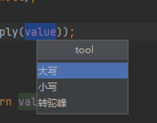
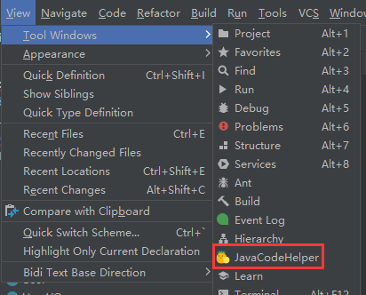

# 功能简介
intellij idea 中搜索插件 Java Code Helper。 欢迎交流想法、反馈BUG 
最低版本201.7223.91 (2020.1.1) 
源码 <a href="https://gitee.com/zlfzh/javaCodeHelper" target="_blank">Gitee</a> | <a href="https://github.com/zhanglinfeng1/javaCodeHelper" target="_blank">Github</a>

## 代码补全
构造方法内，补全字段赋值 
非构造方法内，根据输入的字符，补全代码 
根据注解补全方法参数 
mybatis的xml补全需在空格和#{、${之间没有字母的情况下才能触发，有其他字符不影响 
可以触发：user = #{ 、 user =#{ 
不可以触发：user=#{

## 快捷跳转
feign与controller的快捷跳转 
sql与java的快捷跳转 
点击即可跳转 
点击即可生成简易的sql代码 

## 翻译
目前仅支持中译英，英译中 
目前仅支持百度翻译 
在idea中配置账号后，选中待翻译文本，右击选择“翻译” 
配置路径：File > Setting > Other Settings > JavaCodeHelp

## 一键添加api注解
可根据注释一键添加Api注解。目前仅支持swagger 
选中需要添加注解的代码块，右击选择“添加接口文档注解” 
如果不选中代码块，会给整个类添加注解，代码过长时会有卡顿(っ °Д °;)っ

## 代码检查
具体见 File > Setting > Editor > Inspections > JavaCodeHelp 
 

## 代码统计
先配置统计的文件类型（例：.java）。配置路径：File > Setting > Other Settings > JavaCodeHelp > 代码统计 
右击项目视图任意区域，选择'统计代码行数'，会统计每个模块的总代码行数 
右击项目视图任意区域，选择'统计贡献率'，会统计每个模块的代码贡献率（未提交的代码不算做自己的），时间较长，耐心等待 (っ °Д °;)っ 
目前注释判断仅支持.java、.xml文件 
 

## 常用工具
1.选择文本后，右击选择“工具” 
2.打开 View > Tool Windows > JavaCodeHelp  

## 根据建表SQL生成代码
主要用于学习插件开发，功能比较单一，建议使用其他更完善的插件去生成代码 
需要完整的建表语句加comment 
建议使用自定义模板，生成的代码更符合自己的项目。可在配置中下载默认模板，在此基础上修改 
模板变量如下 

    ${author}                   创建者
    ${dateTime}                 创建时间
    ${packagePath}              包路径
    ${sqlTableName}             sql表名
    ${tableName}                java规范表名
    ${firstLowerTableName}      首字母小写表名
    ${tableComment}             表备注

    ${columnList}               字段信息List
        ${sqlColumnName}        sql原始字段名
        ${columnName}           java规范字段名
        ${firstUpperColumnName} 首字母大写的字段名
        ${sqlColumnType}        sql字段类型
        ${columnType}           java字段类型
        ${columnComment}        字段备注

    ${queryColumnList}          用于查询的字段信息List
        ${sqlColumnName}        sql原始字段名
        ${columnName}           别名
        ${queryType}            查询方式
        ${sqlColumnType}        sql字段类型
        ${columnType}           java字段类型
