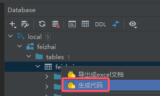

# 功能简介
intellij idea 中搜索插件 Java Code Helper。 欢迎交流想法、反馈BUG 

## 代码补全
构造方法内，补全字段赋值 
非构造方法内，根据输入的字符，补全代码 
根据注解补全方法参数 

## 快捷跳转
feign与controller的快捷跳转 
sql与java的快捷跳转 
点击即可跳转 
点击即可生成简易的sql代码 
xml中的resultMap、refid标签跳转（ctrl+鼠标左击）

## 翻译
目前仅支持中译英，英译中 
目前仅支持百度翻译 
在idea中配置账号后，选中待翻译文本，右击选择“翻译” 
配置路径：File > Setting > Other Settings > JavaCodeHelp

## 一键添加api注解
可根据注释一键添加Api注解。目前仅支持swagger2、swagger3 
选中需要添加注解的代码块，右击选择“添加接口文档注解” 
如果不选中代码块，会给整个类添加注解，代码过长时会有卡顿(っ °Д °;)っ

## 常用工具
1.选中文本后，右击选择 "工具" ，包含大写、小写、转驼峰、转小写下划线 
2.打开 View > Tool Windows > JavaCodeHelp，包含以下功能  

    unicode：unicode与字符串的互相转换
    urlEncode：url的encode和decode
    ascii码：ascii码与字符串的互相转换
    二维码：二维码的生成与解析
    cron表达式：解析cron表达式，展示最近的5次执行时间
    时间戳转换：时间戳与字符串的互相转换
    加解密：一些常用的加解密方式

## 代码检查
具体见 File > Setting > Editor > Inspections > JavaCodeHelp 
 

## 代码统计
先配置统计的文件类型（例：.java）。配置路径：File > Setting > Other Settings > JavaCodeHelp > 代码统计 
右击项目视图任意区域，选择'统计代码行数'，会统计每个模块的总代码行数 
右击项目视图任意区域，选择'统计贡献率'，会统计每个模块的代码贡献率（未提交的代码不算做自己的），时间较长，耐心等待 (っ °Д °;)っ 
目前注释判断仅支持.java、.xml文件 
 

## 自定义模版生成代码
主要用于学习插件开发，功能比较单一，建议使用其他更完善的插件去生成代码 
Database中右击选中  
模板变量如下 

    ${author}                       创建者
    ${dateTime}                     创建时间
    ${packagePath}                  包路径
    ${sqlTableName}                 sql表名
    ${tableName}                    java规范表名
    ${firstLowerTableName}          首字母小写表名
    ${tableComment}                 表备注

    ${columnList}                   字段信息List
        ${sqlColumnName}            sql原始字段名
        ${columnName}               java规范字段名
        ${firstUpperColumnName}     首字母大写的字段名
        ${underlineUpperColumnName} 下划线格式、全小写的字段名
        ${sqlColumnType}            sql字段类型
        ${columnType}               java字段类型
        ${columnComment}            字段备注

    ${queryColumnList}              用于查询的字段信息List
        ${sqlColumnName}            sql原始字段名
        ${columnName}               别名
        ${queryType}                查询方式
        ${sqlColumnType}            sql字段类型
        ${columnType}               java字段类型
